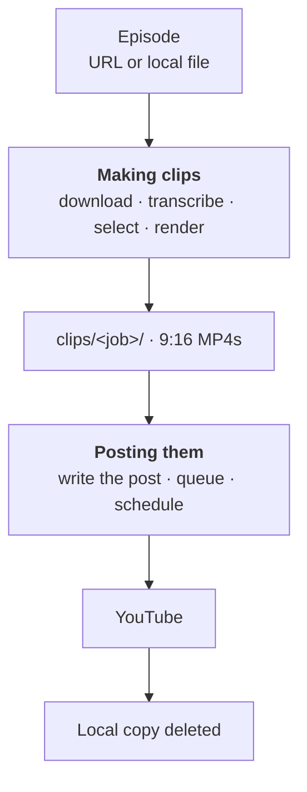
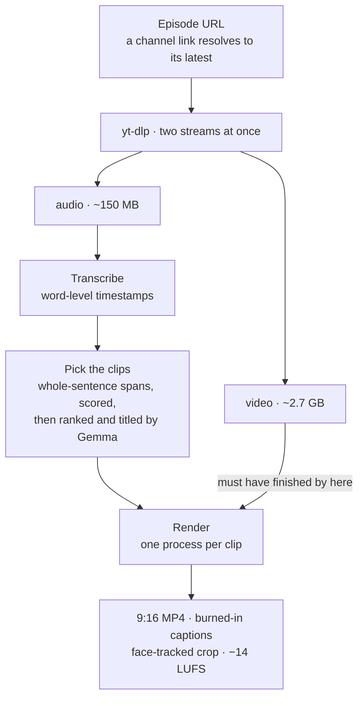
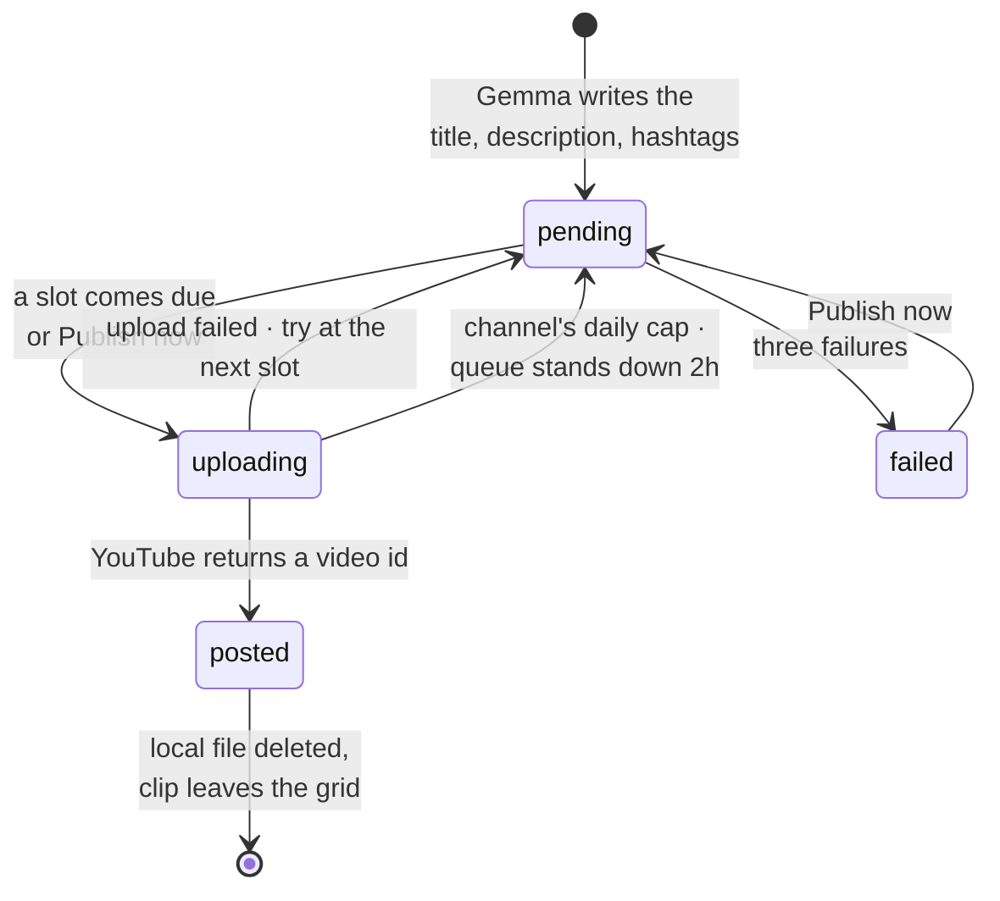

# OpenClips

Turn a long podcast or interview into vertical short-form clips, entirely on your
own machine. Give it a YouTube link or a local file and it returns 9:16 MP4s with
word-by-word captions burned in, framed on whoever is speaking, ready to post.

No cloud service, no per-clip credits, no watermarks. Transcription and clip
selection both run locally.

## What it produces

Each clip is a 1080x1920 MP4 containing:

- **Word-by-word captions**, the active word highlighted, drawn directly by the
  renderer (no libass or system fonts required beyond a bold TTF)
- **Face-aware framing** that follows the speaker and re-frames at camera cuts,
  instead of a fixed centre crop that slices people out of shot
- **A complete thought**, 28-75 seconds, starting on a real sentence and ending
  on terminal punctuation
- **Normalised audio** at roughly -14 LUFS, the level social platforms target
- A title taken from the moment's own hook

## Requirements

| | |
|---|---|
| Python | 3.12 |
| FFmpeg | any recent build, on `PATH` (`brew install ffmpeg`, `winget install ffmpeg`, `apt install ffmpeg`) |
| Disk | ~3 GB per hour of source video while a job runs |
| RAM | 8 GB works; the pipeline sizes itself to what is free |
| Ollama | optional, only for AI clip ranking |

FFmpeg does **not** need `libass` or `freetype`: captions are rendered by the
application and composited as images, so minimal FFmpeg builds work fine.

## Install

```bash
git clone https://github.com/hrithiksaini99/OpenClips.git
cd OpenClips
python3.12 -m venv .venv-native
.venv-native/bin/pip install -r requirements-studio.txt
```

On Windows use `.venv-native\Scripts\pip` instead.

## Run

```bash
PYTHONPATH=src .venv-native/bin/python -m studio.server
```

Then open **http://127.0.0.1:8080**.

Paste a link, choose how many clips you want, and press **Generate clips**.
Progress is live; finished clips appear as playable cards you can download.

Accepted inputs:

```
https://www.youtube.com/watch?v=VIDEO_ID
youtube.com/watch?v=VIDEO_ID          # scheme optional
https://youtu.be/VIDEO_ID
https://www.youtube.com/@channel/videos   # uses the channel's latest episode
/path/to/local/episode.mp4
```

Clips are written to `clips/<job-id>/` inside the project, alongside a
`job.json` describing each one. Downloaded sources are cached in `media/source/`
and reused, so re-running an episode costs nothing.

## Controls

| Control | Meaning |
|---|---|
| **Clips** | How many to produce |
| **Model** | Whisper size. `small` is the sweet spot; `medium` is more accurate and roughly twice as slow |
| **Parallel** | Requested concurrency. The pipeline lowers this if memory is tight |
| **Pick clips** | `AI ranked` uses a local LLM; `Fast` uses heuristics only |

## AI clip ranking (optional)

With [Ollama](https://ollama.com) running, a local model reads the shortlisted
moments, scores them, and writes each title. Without it, the heuristic ranking is
used and nothing fails.

```bash
ollama pull gemma3:4b
export OPENCLIPS_LLM_MODEL=gemma3:4b     # default: gemma4:latest
export OPENCLIPS_OLLAMA_HOST=http://localhost:11434
```

Pick a model that fits your VRAM. On a 4 GB card a ~4B model is appropriate; a
larger one still works but runs on the CPU, adding a minute or two per episode.

## Design

Two halves that meet at a rendered file. The first turns one long episode into
clips; the second writes a post for each clip and puts it on YouTube on a
schedule. They share nothing but the folder the clips land in, so either can be
used without the other.



### Making clips

The shape of this stage is set by one fact: the audio is about 150 MB and the
video about 2.7 GB. Fetching them as separate streams means transcription — the
other slow stage — starts on the audio while the video is still arriving, so the
two longest parts of the job overlap instead of queueing.



Three choices are worth knowing about:

- **Clips start and end on sentences.** Spans are built from whole sentences
  rather than fixed windows, which is what stops a clip opening mid-thought.
- **The model reads a shortlist.** The heuristics find spans that are well
  formed and energetic; they cannot tell whether a moment is interesting. Three
  times as many candidates as needed go to Gemma, which picks and titles them.
- **Rendering is process-parallel, transcription is thread-parallel.** Whisper
  slices share one model instance because the weights dominate memory; FFmpeg
  work does not share anything, so it gets real processes, as many as free
  memory allows.

### Posting them

Each clip becomes a queue entry with a post written for it. A thread wakes every
30 seconds, and if a configured time of day has come round, it posts one clip.



The entry is marked `uploading` **before** the upload starts, not after. That is
what stops a scheduler tick landing mid-click from posting the same clip twice.

### Where state lives

Everything is a JSON file next to the media it describes, so the whole system is
readable from Finder and survives a restart without a database.

| Path | Holds | Written by |
|---|---|---|
| `clips/<job>/job.json` | one run: stage, progress, and a record per clip | the job thread, several times a second |
| `clips/<job>/*.mp4` | the rendered clips, and their thumbnails | the render workers |
| `clips/publish.json` | the schedule, the queue, storage settings | the scheduler and the API |
| `media/source/<video-id>.*` | downloaded episodes, keyed by video so a re-run reuses them | yt-dlp |
| `config/` | the YouTube OAuth client and refresh token | the OAuth callback |

Both state files are written to a temporary sibling and renamed, so a reader
never sees a half-written file. That is not theoretical: a plain write let the UI
read a truncated `job.json`, which returned a 500 and killed its polling loop.

### When something goes wrong

Nothing here retries blindly, because the useful response depends on what failed.

| What happened | What it does |
|---|---|
| YouTube rate-limits a download | Waits 60s, then 120s, and says so on the progress bar. An upgrade is never spent on it — it cannot fix a limit |
| The channel's daily upload cap | The clip keeps its file and spends no attempt; the whole queue stands down for two hours |
| An upload interrupted by a restart | On startup, asks YouTube what actually landed, records those, re-queues only the rest |
| A single upload fails | Retried at the next slot, parked after three attempts with the reason on screen |
| Ollama is not running | Falls back to heuristic titles and a plain description; no clip is lost |
| A custom thumbnail is refused | Noted against the entry; the video is already up and stays up |
| A run fails, or its clips are all posted | The empty job folder is cleared out on the next start |

The interrupted-upload case is the one that bites hardest. An entry is claimed
before its upload begins, so a process that dies leaves it claimed forever unless
something releases it — and releasing it blindly is worse, because the clip may
have reached YouTube with only the bookkeeping lost. Reconciling against the
channel is the only answer that neither strands the entry nor posts it twice.

## Performance

Measured on an M4 Pro for a 2.5 hour episode:

| Stage | Time |
|---|---|
| Download | ~12 min (concurrent fragments; ~2-3 MB/s) |
| Transcription | ~10 min at `small` |
| Selection + LLM ranking | under a minute |
| Rendering 12 clips | ~1-2 min |

Transcription peaks around 1.4 GB regardless of worker count, because parallel
slices share a single model rather than loading one copy each.

### GPU

Transcription runs on the CPU by default. On an NVIDIA card, CTranslate2 supports
CUDA and `large-v3` at int8 needs roughly 2.5 GB of VRAM. On Apple Silicon
CTranslate2 has no Metal backend, so the CPU path is used there.

## The job list

Only runs that produced clips are kept, plus the most recent empty one so a
fresh failure stays visible. Older empty folders — a run that failed, or one
whose clips have all been posted and reclaimed — are cleared when the server
starts and when the next run begins.

If the server is stopped while a run is in progress, that job is marked
interrupted on the next start rather than left saying "running" forever. The
downloaded audio is cached under the video id, so starting the same link again
resumes from there rather than re-downloading.

## When YouTube refuses the download

yt-dlp reports a refusal as a dozen warnings with one actionable sentence in the
middle, so the studio picks that sentence out and leads with it. Three are worth
knowing about:

- **`HTTP Error 429: Too Many Requests`** — YouTube is rate-limiting the
  machine, not rejecting the link; it affects every video rather than one. It is
  usually a passing squall, so the download waits and retries by itself, backing
  off further each time. Requests are paced and fragments limited to four per
  stream to avoid provoking it in the first place — audio and video download at
  once, so that is eight in flight, and sixteen was enough to earn the limit.
- **"Sign in to confirm you're not a bot"** — YouTube challenged the player
  client that asked, not the machine. The download is retried automatically as a
  different client, which is usually waved through and offers the same formats,
  so most of these never reach you. If every client is refused, the challenge is
  usually still intermittent and the same link often works minutes later. For a
  persistent one, point the studio at your browser's cookies:

  ```bash
  export OPENCLIPS_COOKIES_FROM_BROWSER=chrome   # or firefox, safari, edge, brave
  ```

  or `OPENCLIPS_COOKIES_FILE=/path/to/cookies.txt` for an exported jar. Nothing
  is read unless one of these is set: they are your live YouTube session.
- **"No supported JavaScript runtime"** — YouTube extraction needs one, and
  yt-dlp enables only Deno by default. Install Deno, Node or Bun and it is found
  and passed automatically.

## Troubleshooting

**`Required tool 'yt-dlp' was not found`** — install it into the same virtualenv
you run the server from: `.venv-native/bin/pip install yt-dlp`.

**A download fails** — yt-dlp is upgraded and the download retried once
automatically, since YouTube-side changes are the usual cause. If it still fails,
upgrade manually: `.venv-native/bin/pip install -U yt-dlp`.

**An interrupted download** resumes from where it stopped on the next run; do not
delete `media/source/` if you want to keep that progress.

**Captions look wrong or missing** — the renderer needs a bold TrueType font. It
looks for Arial Black, Impact, then DejaVu Sans Bold, and falls back to a default
face if none is present.

## Posting to YouTube automatically

OpenClips can attach a YouTube account, write each clip's title, description and
hashtags with Gemma, and post them on a schedule without further involvement.

### Read this before you set it up

**Uploads from an unaudited API project are locked to private.** Google forces
every video that `videos.insert` receives from a project created after 28 July
2020 into private, and states the decision cannot be appealed — the only fix is
re-uploading through an audited project or by hand. Your posts will go up, on
schedule, with the right metadata, and only you will be able to watch them until
the audit passes. Apply through the
[YouTube API Services audit form](https://support.google.com/youtube/contact/yt_api_form);
until then leave the visibility setting on Private, because that is what it will
be regardless.

Two smaller things worth knowing:

- Uploads are cheap. `videos.insert` costs 1 unit in its own quota bucket, with
  a limit of 100 calls a day, separate from the 10,000-unit pool everything else
  draws on. Three posts a day is nowhere near it.
- These clips are cut from somebody else's episode. That is what the audit looks
  hardest at, and it is a risk to the audit and to the channel.

Two things are therefore appended to every description by the code, never asked
for in the prompt: the **source credit** (episode title and original URL) and a
**copyright disclaimer**. Neither depends on what the model returned, and the
body is trimmed to fit around them rather than the description being cut to
length, so a long description cannot drop either one. The wording lives in
`DISCLAIMER` in `src/studio/metadata.py` and can be replaced without touching the
source:

```bash
export OPENCLIPS_DISCLAIMER="Your own wording and contact address."
```

A disclaimer is a courtesy and a takedown route. It is not a legal defence and
does not by itself create fair use — how the clip is actually used decides that.

### Setting it up

Hosted tools like Opus Clip and Repurpose.io connect in one click because they
are approved YouTube API partners: one audited Google Cloud project of their
own, which every customer signs into. A tool you run yourself has no such
project, so the first connection needs one — the same trade rclone makes with
Google Drive. It is a one-off, and the **Publishing** panel walks through it
with a direct link for each step:

1. Create a Google Cloud project.
2. Enable **YouTube Data API v3**.
3. Fill in the OAuth consent screen and **set it to "In production"**. Left in
   "Testing", Google revokes the login after seven days and the schedule stops
   posting with no obvious cause.
4. Create an **OAuth client ID** of type **Desktop app** and download the JSON.

Then drop that file onto the panel, or just press **Use this** — OpenClips looks
in your Downloads folder and offers the file Google gave you. The consent screen
opens, you approve it, and posting starts. The file is copied to `config/`, which
is git-ignored along with the token stored beside it.

After that first setup, connecting an account is one click.

### Shipping a one-click build

If you run an OpenClips project that has passed the YouTube API audit, set

```bash
export OPENCLIPS_YT_CLIENT_ID=…apps.googleusercontent.com
export OPENCLIPS_YT_CLIENT_SECRET=…
```

and the console steps disappear for everyone using that build: the panel goes
straight to **Connect**. Be aware the 100-uploads-a-day bucket is then shared
between all of them.

### Running it

The **Schedule** card holds the controls:

- **Post at** — the times of day a clip goes up, one clip each. The number of
  times you pick *is* how many post per day; there is no second control that
  could disagree with it.
- **Visibility** — private, unlisted or public (see the warning above).
- **Queue new clips automatically** — on by default: every clip from a finished
  job is written up and queued without asking.
- **The arm toggle** — nothing is posted until you turn this on. It is off by
  default and stays off across restarts until you change it.

**Publish all** posts everything waiting immediately, one upload at a time, and
carries on past any clip that fails rather than stopping the batch.

The **Queue** shows what is waiting and when each clip goes up. Posted entries
fold away into a summary that keeps their links. Titles are
editable in place; click one and type. A failed upload retries at the next slot
and parks itself after three attempts with the reason shown.

### Two different limits

They get confused because both look like "you can't upload any more":

- **The API quota** belongs to your Google Cloud project: `videos.insert` costs
  1 unit in its own bucket, 100 calls a day. You will not reach it.
- **The channel's upload limit** belongs to your YouTube channel and is much
  lower — often around a dozen a day for a new or unverified one. YouTube does
  not publish the number, it varies with the channel's age and standing, and it
  rolls over 24 hours after each upload rather than resetting at midnight.
  Verifying at [youtube.com/verify](https://www.youtube.com/verify) raises it.
  Nothing on the API side changes it; it is not a quota you can request more of.

Hitting the channel limit is treated as a wait, not a failure: the clip keeps
its file, spends none of its three retries, and the whole queue stands down for
two hours before trying again.

A slot only fires while the server is running. If the machine was asleep at
09:00 the clip still posts when it wakes, but only within two hours of the slot
— otherwise starting the app in the evening would fire the whole day at once.

## Storage

One episode leaves about 3.2 GB behind: the source MP4, its audio track, and the
clips. The **Storage** card in the Publishing panel shows what is held and
controls two clean-ups, both on by default:

- **Delete the episode once clips are made** — frees the ~2.9 GB source as soon
  as every clip has rendered. The cost is that re-running that episode
  re-downloads it in full, since this is the same cache that made re-runs free.
- **Delete a clip once it is posted** — once YouTube confirms the upload, the
  render and its images are removed and the clip leaves the results grid. It is
  on YouTube; the queue keeps the link under "already posted".

Neither ever touches a local file you pointed the app at, and neither runs on a
job that failed.

## Thumbnails

Off by default, because a channel that has not been phone-verified cannot set
custom thumbnails and generating them would be work for a file YouTube refuses.
Verify at [youtube.com/verify](https://www.youtube.com/verify), then turn
**Make custom thumbnails** on in the Storage card. With it off, no thumbnail is
built during rendering at all.

With it on, every clip gets a 1280x720 thumbnail: a frame from the original episode with the
hook drawn across it. The frame comes from the source rather than the rendered
clip, because the render has captions burned in and they read as clutter behind
the thumbnail's own text.

It is offered to YouTube with `thumbnails.set` after the upload lands. Even on a
verified channel this can still be refused: Shorts thumbnails additionally need
Partner Programme membership, and YouTube's July 2026 rollout describes them as
a Studio feature, so the API may decline them for now. A refusal is recorded
against the queue entry and never fails the post.

Worth knowing either way: a Shorts thumbnail never shows in the vertical Shorts
feed. It shows in search, the channel grid, the Shorts shelf and subscriptions.

## Repository layout

```
src/studio/      the native pipeline described above
src/openclips/   an earlier Docker/PostgreSQL/Redis service with a review
                 dashboard and publishing queues; independent of src/studio
web/index.html   the browser UI
clips/           generated clips and the publish queue (git-ignored)
media/           downloaded sources, cached by video id (git-ignored)
config/          YouTube OAuth client and token (git-ignored)
```

## Not implemented

Honest about the gaps: no split-screen or multi-speaker layouts, no automatic
channel polling (a channel URL takes the latest episode only), no B-roll or zoom
effects, and no posting to anywhere but YouTube.

## Licence

[GNU Affero General Public License v3.0](LICENSE).

You may use, study, modify and redistribute this, and any redistribution — or
any modified version you let people reach over a network — has to be offered
under the same licence, with source. That last part is the point of the Affero
clause: running a modified copy as a service counts as distribution.

Every dependency is permissive (MIT, BSD, Apache-2.0, Unlicense), so none of
them conflicts. FFmpeg is invoked as a separate program rather than linked, so
its licence does not reach this code either — though a packaged build that ships
an FFmpeg binary built with `--enable-gpl` is distributing GPL software and
carries that binary's own obligations.

```
OpenClips — podcasts into postable vertical clips
Copyright (C) 2026 Hrithik Saini

This program is free software: you can redistribute it and/or modify it under
the terms of the GNU Affero General Public License as published by the Free
Software Foundation, either version 3 of the License, or (at your option) any
later version.

This program is distributed in the hope that it will be useful, but WITHOUT ANY
WARRANTY; without even the implied warranty of MERCHANTABILITY or FITNESS FOR A
PARTICULAR PURPOSE. See the GNU Affero General Public License for more details.

You should have received a copy of the GNU Affero General Public License along
with this program. If not, see <https://www.gnu.org/licenses/>.
```
